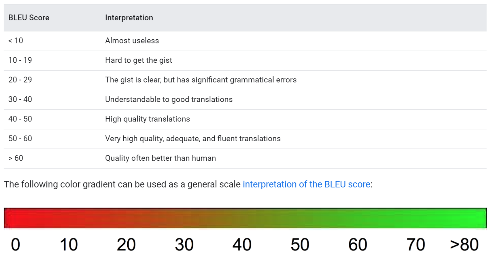

# The Spanish Locale Study: 

## Evaluating Linguistic Distinction Between Locales of the Same Language

**Kekoa Riggin**  
_kekoariggin@gmail.com_

## Abstract

_An analysis of the linguistic distinctiveness between Spanish locale variants in localization files, using the BLEU metric and basic language templating. The linguistic distinctiveness between sibling locales raises questions about the value of maintaining ongoing localization efforts for multiple locales of a single language. If dinstinguishing features of a locale are meaningful, frequent, and consistent, locales have instrinsic linguistic value._

## Background

Localization is said to adapt a product to the point of feeling like it was created in and for a target market. The first indication of Localization's meticulous effort is the language code, which includes an indicator for language followed by an indicator for nation or region (eg. `en-CA`: English Canada). A product can be tailored, not only for an English-speaking market, but to the Canadian English-speaking market. But if locale-specific customization is the unique strength of Localization, then why do the locale offerings vary from localized product to localized product?

The answer to this is simple, yet multivariant and unique for each product. Some organizations have far more capital that can be spent on localization at the early stages of a product's development, while others simply don't have the resources to do so. Some products don't have a strong outlook in certain markets, and the investment doesn't have a promising enough return. And with the growth of language technology in high-resource languages, the disparity between localization processes accross languages can seem larger than ever before. These are just few of many reasons.

To mitigate some of these trouble areas in localization, globally-minded teams have developed an increasing number of solutions. Some products are delivered to the subset of world languages that makes sense for their projections. Developers leverage internationalization libraries to format certain pieces of data according to known regional standards, technically increasing the number of offered locales at a minimum cost. Other organizations, like Mozilla Firefox, crowdsource their localizations from the loyal community that uses and depends on their product, potentially offering a record-breaking number of localizations at the cost of managing a volunteer community<sup>[1](#references)</sup>. 

If organizations take varied approaches to localization due to questions of ROI, is there a way of measuring the return on the investment? Given that localization covers such a large set of considerations, it will de difficult to attribute increases in products sold or daily active users to any individual implementation beyond a case-by-case basis. But this is not an admission of defeat!

Perhaps surveys of user satisfaction regarding localization could provide qualitative and/or quantitative feedback to assess the return on investment in localization. But even then, can users tell the difference between high- and low-investment localizations? Do they even care? Some studies indicate that the bar for localization quality may be lower than expected<sup>[2](#references)</sup>. Mozilla even discovered recently that they were offering identical localized data for two different Spanish locales due to a miscommunication between volunteer localization communities (which was a catalyst for this very study).

## Proposition

This study proposes an evaluation of localization ROI by way of analyzing parallel translations of sibling locales (ie. distinct locales of a single language). By evaluating the translations of sibling locales, this study intends to measure the value of localizations at the text level. 

For the purpose of this study, "value" is defined as the unique combination and frequency of linguistic features found in a localization, characteristic of a specific locale. Localizations that demonstrate a greater number of unique features and a higher frequency of instances of those features would be the most linguistically distinct and, therefore, more valuable from a purely textual standpoint. This study assumes two premises: _a)_ all localizations evaluated in the study are considered to be high quality and reflective of the linguistic nature of the locale and _b)_ where the features of a locale can be found in another, that locale provides no additional material value to a client of localization services. Only where a locale can be shown to contain unique, distinguishable features, does that locale provide a material value for a client. 

Recent advances in machine translation have brought about a need for fast, reliable translation quality assessment. Automatic systems, like BLEU, make use of computational power and collections of translated corpora to produce translation quality scores almost instantaneouly<sup>[3](#references)</sup>. Systems like BLEU are not without cause for caution, but they have been shown to produce translation qualty scores similar to those produced by manual methods of assessment<sup>[4](#references)</sup>. In addition to a purely quantitative analysis, other text processing techniques, such as templating, allow us to take a cursory look at the tangible differences between translations. 

Making use of translation memory data, this study assesses the value of sibling locales at a purely textual level by applying the BLEU metric and templating techniques.

## Data

The main data for this study comes from Mozilla's translation repositories for the Firefox browser in a standard TMX file format<sup>[5](#references)</sup>. The Spanish locales available are `es-AR` (Argentina), `es-CL` (Chile), `es-ES` (Spain), and `es-MX` (Mexico). Mozilla offers an International Spanish localization, but that localization is almost entirely identical to the `es-ES` localization, providing no linguistically-valuable insight (this discovery was the initial cause for this study). Therefore, the International Spanish locale is excluded from this study.

To ensure the simplest and clearest results, many translation units were removed from the data used for this study.

**Types of Translation Units Removed**

1. Translation units with IDs that are not present in all five Spanish locale variants.
2. Non-translatable strings (ie. segments where the target string is identical to the source).
3. “Junk” strings (ie. source strings with the appearance of linguistic “nonsense” such as a high ratio of non-alphabetic characters, indicating markup code).
4. Translation units with source strings that appear more than once in the data.

The data cleaning approach used in this study leans toward simplicity and practicality, so the margin of error is set to remove questionable translation units and keep only translations that have an appearance of linguistic salience. 

It should be noted that many of the strings removed likely contain real linguistic phenomena that would be valuable to a localization study like this one. For example, many strings containing only a single character are removed. Among these strings are localized keyboard shortcut commands. These are a highly important consideration in localization, but are unfortunately outside of the scope of this study.

All translation units with a source string identical to that of another translation unit are removed to avoid skewing results by way of double-counting of a particular linguistic phenomenon. Rather than including these segments, they are set aside to be used later to establish a baseline of variance. Given that these translations have the same source text and target locale, the linguistic differences between them should be inconsequential, at least with regard to the translation's acceptability. Many of the duplicate source strings have identical translations, but some translations within the same locale contain text variation.

In addition to the Mozilla translation data, this study uses Microsoft's My Visual Studio Translation and UI Strings Glossaries<sup>[6](#references)</sup>, which is available for free with a Visual Studio Dev Essentials account. Unfortunately, there were not enough matching strings between Microsoft's Spanish locales to perform an analysis for each sibling locale pair. The methodology for this study is replicated on `es-ES` and `es-MX` locale pair in the Microsoft data to see if the results found in the Mozilla data are consistent in another independent data set.

## Methodology

This study consists of three phases of analysis: ***Similarity***, ***Difference***, and ***Replication***.

### Similarity

**High Confidence Similarity: Perfect Matches**

It is sometimes the case that a pair of parallel translations by different translators are identical, even more so when the domain of the translation is highly-specialized--as is the case with software translation resources. When parallel translations for different target locales are identical, we know for certain that the single translation is acceptable within the conventions of either locale. These identical translations are called "perfect matches" in this study, and are used to assess the high-confidence similarity between sibling locales.

**Lower-confidence Similarity: BLEU Scores**

In this study, the Bilinguial Evaluation Understudy (BLEU score) is used as the means of measuring translation similarity when parallel translations are not identical. In these cases, we rely on the historic use of the BLEU score as a means of measuring translation acceptability to warrant our use. Acceptability is the appropriateness of a translation for the recieving audience. In this case, the more a candidate translation resembles a gold standard translation in the target locale (by way of BLEU score), the higher that translation's acceptability. The BLEU scores in this study were calculated using NLTK's BLEU module.

Because the BLEU score is an automated metric, it provides no qualitative evaluation of translation similarity but simply a measure of similarity between the superficial tokens of the translations. For these reasons, we make the distinction between the perfect matches "high-confidence" and the BLEU score's "low-confidence" similarity.

### Difference

**Language Templates**

Phrase templates help identify the surface tokens that form distinguishing structural features of a collection of texts. Templates become a means of focusing on what is congruent accross locales and what distinguishing features (particularly consistent ones) exist between them. 

To generate the templates of this study, for each non-perfect match all shared word sequences (n-grams) are identified between sibling translations. Starting from largest shared word sequences and continuing to the smallest, the matching sequences between the parrallel translations are removed. This leaves a simple template of changes between locale variants on the word-sequence level. These templates are simplified and then counted for occurrences. The templates with the most occurrences represent the changes that happen most frequently between locale variants. Where templates have a high frequency in only one direction (from Locale X to Locale Y), a material linguistic distinction between locales has been identified.

This method does have some limitations as some templates contain a combination of different linguistic phenomena that would be best evaluated on an individual basis for best quantitative results. This level of detail is beyond the scope of this study. More robust processing or even manual analysis of the differences between locales would provide a clearer look into the patterns of difference between locales. The language templating method used in this study still provides some interesting insight.

### Replication

This study was originally intended only as an assessment of Mozilla's localization data. However, once that data had been processed, we wanted to validate the results by replicating the methodology on an independent dataset. Because the methodology for this study is predominantly automated text processing, it can be replicated fairly easily on independent data. The results for the Microsoft data is included alongside the Mozilla results.

## Results

### Perfect Matches

In the Mozilla data, 1743 of 7620 shared translations between all four Spanish variants were perfect matches among all five locale variants (23%). Between each locale pair, an average of 40% of all shared translations were perfect matches. At a rate of 40%, between all four of Mozilla's Spanish localizations, that makes more than one and a half locale's worth of duplicate being done by Mozilla's volunteer translators.

**Perfect Matches Mozilla TM**

| ~     | es-AR | es-CL | es-ES | es-MX | AVG   |
| -     | -     | -     | -     | -     | -     |
| es-AR | ~     | 0.385 | 0.405 | 0.416 | 0.402 |
| es-CL | 7805  | ~     | 0.388 | 0.427 | 0.400 |
| es-ES | 14343 | 7715  | ~     | 0.452 | 0.415 |
| es-MX | 12355 | 8029  | 12651 | X     | 0.426 |

**_Bottom Left:_** The number of segments compared.  
**_Top Right:_** Ratio of perfect matches.   

The minimum portion of perfect matches was 38.5% between `es-AR` and `es-CL` and the maximum 45.2% between `es-ES` and `es-MX`.

`es-MX` had the highest number of perfect matches between all other locales, meaning that, based on perfect matches alone, it is the most similar or "neutral" in relation to the other locales. `es-CL` stands the least similar locale on average. Based on perfect matches alone, `es-CL` is the most linguistically valuable as it is the most unique or different.

The Microsoft data showed a higher rate of perfect matches between the `es-ES` and `es-MX` locale pair. 

**Perfect Matches Microsoft**

| ~     | es-ES | es-MX |
| -     | -     | -     |
| es-ES | ~     | 0.639 | 
| es-MX | 25024 | ~     | 

**_Bottom Left:_** The number of segments compared.  
**_Top Right:_** Ratio of perfect matches.  

The results from Mozilla and Microsoft indicate that Spanish localizations of software strings are considerably similar. Roughly half of all translations from one locale variant are absolutely acceptable in the context of another locale variant. At first glance, this seems like a hight ratio of perfect matches, but, given the nature of software localization, it may not be unexpected or problematic. The other methods should be evaluated before making any conclusions.

### BLEU Scores

For Mozilla's locales, BLEU scores averaged between 56 and 59. For other BLEU studies, these scores would seem very high, but perhaps not for this study.

**BLEU Scores Mozilla TM**

| ~     | es-AR | es-CL | es-ES | es-MX | AVG   |
| -     | -     | -     | -     | -     | -     |
| es-AR | ~     | 0.562 | 0.557 | 0.566 | 0.562 |
| es-CL | 0.564 | ~     | 0.564 | 0.603 | 0.577 |
| es-ES | 0.556 | 0.564 | ~     | 0.600 | 0.574 |
| es-MX | 0.567 | 0.602 | 0.599 | ~     | 0.589 |

**_Column:_** Reference.  
**_Row:_** Candidate. 

According to Google Cloud's Translation Guide, BLEU scores in the 50-60 range reflect "very hgih quality, accurate, and fluent translations," which our data happens to be. When BLEU scores are applied to machine translation output, scores in this range would, in fact, be absurdly high. But these BLEU scores reflect the very nature of our data: "very high quality, adecuate, and fluent [Spanish] translations" of the Firefox browser.

**Google Cloud's Translation Guides Table**<sup>[7](#references)</sup>



Again, we see `es-MX` standing out as the most central of the locale bunch and `es-AR` being the most unqiue.

Microsoft's BLEU scores, however, tell another story.

**BLEU Scores Microsoft**

| ~     | es-ES | es-MX |
| -     | -     | -     |
| es-ES | ~     | 0.793 | 
| es-MX | 0.792 | ~     | 

**_Column:_** Reference.  
**_Row:_** Candidate. 

Microsoft's data returned incredibly high BLEU scores, indicating that these locales are concerningly similar. Given the high number of perfect matches found in the Microsoft data, a higher BLEU is to be expected, but according to Google Cloud's translation guides, BLEU scores at this level are beyond human-quality translation. This seems to show that Microsoft's translations are similiar beyond meaningful distinction between locales. 

### Language Templates

In the previous sections, we discovered that Spanish locale variants appear to be very similar. This method exposes the nature of differences between localizations and how frequent and consistent those changes are. 

This sample output shows the top 25 most frequent templates generated from the `es-ES es-MX` pair. 

```
es-ES to es-MX
1	59	añadir | agregar
2	56	su | tu
3	16	introduzca | por favor ingresa
4	12	vídeo | video
5	9	ha | has
6	8	está | estás
7	8	preliminar | previa
8	8	haga | haz
9	8	ha sido | fue
10	7	buscador | motor de búsqueda
11	7	informe | reporte
12	7	no __ | __ __
13	7	pulse | haz clic
14	7	identificación | autenticación
15	7	cabeceras | encabezados
16	6	__ mediante __ utiliza __ | __ a través de __ usa __
17	6	le | te
18	6	caducado | expirado
19	6	icono | ícono
20	6	ha podido | pudo
21	6	¿va a permitir __ su __ | ¿le permites __ tu __
22	6	iconos | íconos
23	6	han encontrado | encontraron
24	6	repeticiones | ocurrencias
25	6	elija | elige
```

Here we can see a number of contradictory preferences for each locale. For example, based on templates 2, 3, 5, 6, 8, 13, 17, 21, and 25 we can see that `es-ES` has a strong preference for a formal register and `es-MX` has a strong preference for an informal register. Additionally, based on templates 9, 20, and 23 `es-ES` has a preference for the past particple form while `es-MX` prefers the past tense.


It doesn't come as a surprise that locales have some clear linguistic distinctions, but the dregree of similarity seen in the previous methods brings into question the degree to which these distinctions are meaningful, frequent, and consistent. For the purpose of this study, so long as a template is consistent and frequent, we will assume that the template represents a meaningful distinction between the locales' conventions. 

A consistent template is any template found in a locale pair where the inverse does not also appear. If `es-ES` changes the verb "agregar" to "añadir" in some translation units, but changes "añadir" to "agregar" in others, then those translation units would give us inverse templates and we can count those as inconsistent. 

**Ratio of TUs with Consistent/Inconsistent Templates Mozilla TM**

|   ~   | es-AR | es-CL | es-ES | es-MX |  AVG +/-      |
| -     | -     | -     | -     | -     | -             |
| es-AR |   ~   | 21.38 | 23.05 | 16.86 | 19.84 / 14.34 |
| es-CL | 12.14 |   ~   | 21.38 | 18.44 | 20.96 / 11.82 |
| es-ES | 14.65 | 10.15 | ~     | 20.29 | 21.54 / 13.02 |
| es-MX | 16.24 | 13.18 | 14.25 |   ~   | 18.51 / 14.56 |

***Bottom left*** : Inconsistent templates  
***Top Right***   : Consistent templates

In the Mozilla data, 20% of all translation units contain a consistent template, meaning that one out of every five translations can be represented by a locale-specific language template. On the other hand, about 13% of all translation units contain an inconsistent template, meaning that, so far as these templates can reveal, the linguistic distinctions are arbitrary. And if the distinction is arbitrary, then it is not linguistically valuable from the standpoint of value according to this study. The remaining 65% or so of translation units are represented by a template that occurred fewer than three times in the results and where therefore counted as inconclusive with regard to value.

In some cases, particularly in the case of `es-MX`, some locales contained a certain template when compared to one sibling locale and contained that template's inverse when compared to a different sibling locale. This seems to indicate that certain locales may have a strong preference for a certain linguistic form while other locales are more felxible when it comes to the linguistic forms that are appropirate for that locale's conventions.

When the Microsoft language templates were assessed, there was a bit of overlap between the Mozilla and Microsoft langauge templates. Of the top 100 most frequent templates for either Microsoft locale, 15 of those templates could be found in the corresponding language templates for Mozilla. Five of the top 50 consistent templates for Mozilla were inconsistent in the Microsoft results. Given that these are completely independent natural language datasets, these results seem fairly normal.

**Ratio of TUs with Consistent/Inconsistent Templates Microsoft**  
| ~     | es    | es-MX |  AVG +/-      |
| -     | -     | -     | -             |
| es    | ~     | 35.82 | 35.82 / 10.36 |
| es-MX | 10.36 | ~     | 35.82 / 10.36 |

***Bottom left*** : Inconsistent templates  
***Top Right***   : Consistent templates

In terms of Microsoft's internal consistency regarding language templates, there was a higher ratio of consistent templates and a lower ratio of inconsistent templates. So where Microsoft demonstrated a high level of similarity in previous methods, it also demonstrates a higher lever of meaningful distinctions between locales.

## Discussion

The similarity methods revealed that Spanish locale variants are very similar. In fact, it may be that localizations for one Spanish variant serve as acceptable translations in the context of another. However, the language templates revealed some meangingful, frequent, and consistent distinctions between locales. These differences appear to have more to do with locale convention than translation accuracy, but still reveal a certain degree of linguistic value, intrinsic to each locale.

Additionally, some locales are more central or neutral in comparison to the group, while other locales are more unique. In the case of Mozilla's translation data, `es-MX` was the most central to the group of sibling locales in terms of perfect matches, BLEU scores, as well as language templates. `es-AR` and `es-CL` scored closely toward more unique. These locales could be said to be similarly dissimilar.

If any conclusion can be made regarding locale similiarity and difference, it is that Spanish locale variants are similar but also different. It is important to note that this conlcusion applies solely to the scope of this study, meaning to the domain of software strings found in localization resources.

## Next Steps

The implications of this study leave some work yet to be done. The methods for this study are precursory; more intensive processing could reveal greater detail into the specific value provided by sibling localizations. Or perhaps manual analysis by skilled linguists is necessary before that value can be revealed.

The number of languages that are heavily serviced within Localization with multiple locales may be a bit small for much more research to be conducted on this topic. Nonetheless, there are a numbner of practical applications for the localization industry as well as adjacent linguistically-focused fields.

The results of this study in particular can be used within the realm of localization to make data-driven decisions regarding the Spanish locale offerings of a software produce. For teams that are expanding, these results indicate that previously-existing localization data can be leveraged to move into a new Spanish-speaking market. Based on perfect matched alone, your product is already halfway to it's next Spanish locale. Teams that are consolidating efforts could use the methods from this study to identify the most central Spanish locale to their userbase and provide one "very high quality, adecuate, and fluent" Spanish translation. With some further work on the language templating method, the minimum edit distance between locales could be measured to help localization-minded teams project the cost of investment in a new locale. 

In terms of l10n-adjacent applications, particularly ambitious teams may look into the posibility of formalizing the differences between locales or applying deep processing methods to generate locale-specific natural language content. Perhaps these kinds of hopeful connections to this study are a bit enthusiastic or, better yet, not imaginative enough. 

## Acknowledgements

Thank you to Mozilla's L10n Drivers team for asking me to participate in this study, for providing the original localization data, and for helping me prepare a proposal for the LocWorld conference. And thank you to LocWorld for allowing me to present the results of this study at the conference.

## References

1. Mozilla breaks localization record
2. Localization quality acceptance ammong users 
3. [BLEU](https://www.aclweb.org/anthology/P02-1040.pdf).
4. BLEU vs Human
5. Mozilla Translation Memories. [Transvision](https://transvision.mozfr.org/).
6. Microsoft Visual Studio Translation and UI Strings Glossaries. [My Visual Studio downloads](https://my.visualstudio.com/downloads).
7. Google Cloud Translation How-to Guides. [Evaluating Models](https://cloud.google.com/translate/automl/docs/evaluate#interpretation).
